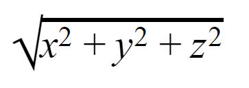

# Unit 3 Section 2 Exercise 1
Modify the distance function so that it will find distance from the origin in 3D space:  
  

## Test cases:
distance(0, 3, 4) = 5  
distance(8, 0, 15) = 17  
distance(21, 20, 0) = 29  
distance(1, 2, 2) = 3  
distance(2, 3, 6) = 7  
distance(4, 4, 7) = 9  
etc.  
